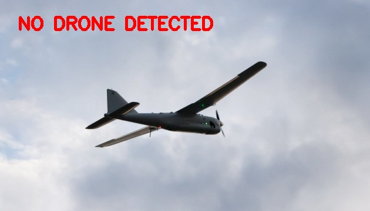
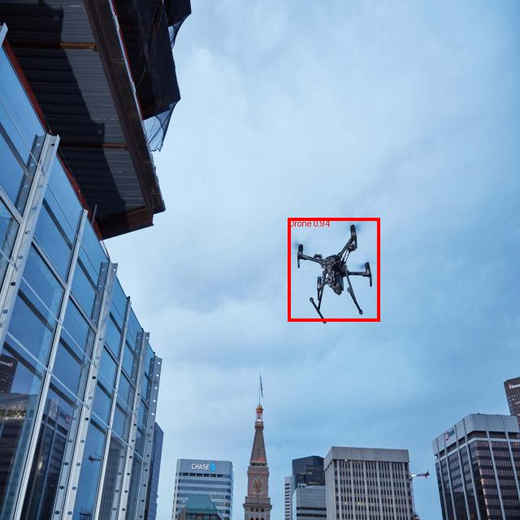
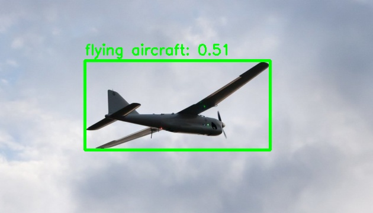
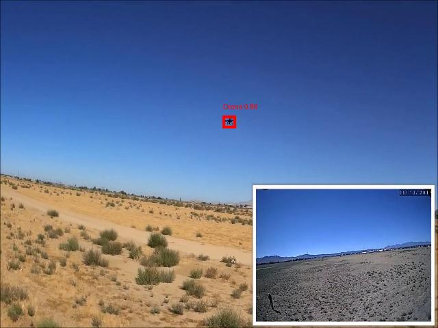
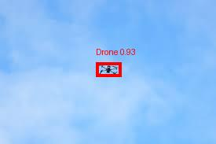
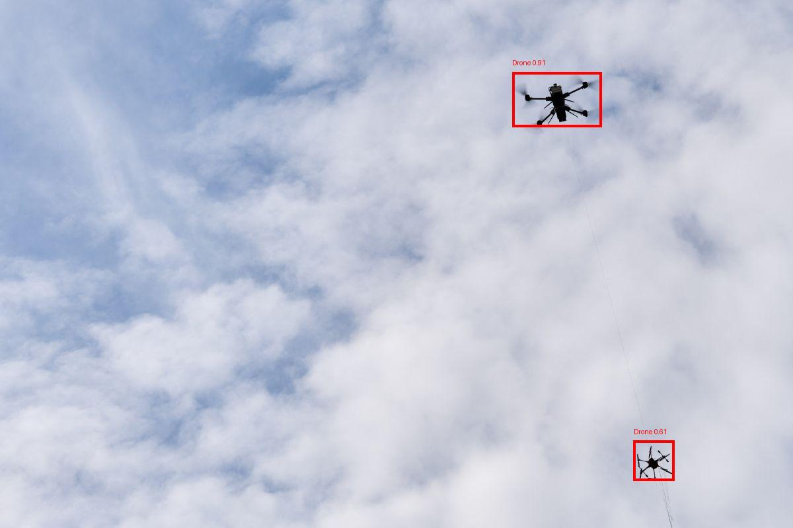

# 🚁 Real-Time Drone Surveillance System

## Detection, Distance Estimation and Automatic Target Lock using YOLO and Deformable DETR

<p align="center">


</p>

---

# 📖 Abstract

The **Real-Time Drone Surveillance System** is an advanced AI-powered surveillance framework developed for intelligent aerial monitoring, defense reconnaissance, target tracking, and autonomous surveillance applications.

The system integrates **YOLO**, **Deformable DETR**, **Transformer Architectures**, **Computer Vision**, and **Distance Estimation Algorithms** to provide real-time detection, localization, tracking, and automatic target lock capabilities.

The framework is designed to operate on drone feeds, surveillance videos, and real-world military monitoring scenarios where accurate target acquisition and tracking are critical.

---

# 🎯 Key Features

### Object Detection

* Real-time object detection
* Human detection
* Vehicle detection
* Drone detection
* Military target identification
* Multi-object recognition

### Transformer-Based Detection

* Deformable DETR implementation
* Attention-driven localization
* End-to-end transformer architecture
* Small object detection improvements

### Distance Estimation

* Camera-based distance approximation
* Relative object positioning
* Target range estimation

### Automatic Target Lock

* Continuous object tracking
* Persistent target locking
* Target reacquisition
* Real-time surveillance assistance

### Zero-Shot Detection

* Open-vocabulary detection
* Generalized drone recognition
* Detection of previously unseen targets

### Video Analytics

* Frame-by-frame inference
* Live surveillance processing
* Alert generation
* Tracking visualization

---

# 📸 Experimental Results

---

## Target Localization

<p align="center">

</p>

<p align="center">
<b>Automatic Target Identification and Localization</b>
</p>

---

## Real-Time Detection Output

<p align="center">

</p>

<p align="center">
<b>Real-Time Object Detection Results</b>
</p>

---

## Zero-Shot Drone Detection

<p align="center">

</p>

<p align="center">
<b>Zero-Shot Drone Detection using Transformer-Based Models</b>
</p>

---

## Validation Results

<p align="center">

</p>

<p align="center">
<b>Validation Dataset Detection Output</b>
</p>

---

## Additional Results

<p align="center">


</p>

<p align="center">
<b>Additional Experimental Detection Outputs</b>
</p>

---

# 🏗 System Architecture

```text
Video Stream / Drone Feed
            │
            ▼
      Frame Extraction
            │
            ▼
      Image Preprocessing
            │
            ▼
 ┌─────────────────────┐
 │   YOLO Detector     │
 └─────────────────────┘
            │
            ▼
 ┌─────────────────────┐
 │ Deformable DETR     │
 │ Transformer Module  │
 └─────────────────────┘
            │
            ▼
      Object Detection
            │
            ▼
      Distance Estimation
            │
            ▼
      Target Tracking
            │
            ▼
      Automatic Lock-On
            │
            ▼
      Surveillance Output
```

---

# 🧠 Methodology

The framework follows a multi-stage pipeline:

### Stage 1 — Data Acquisition

Video streams are captured from drones, surveillance cameras, or prerecorded datasets.

### Stage 2 — Preprocessing

Frames are extracted and processed using OpenCV-based transformations.

### Stage 3 — Object Detection

Two complementary detection frameworks are used:

#### YOLO

Provides:

* High-speed inference
* Real-time deployment
* Fast localization

#### Deformable DETR

Provides:

* Transformer-based object understanding
* Enhanced localization
* Improved detection accuracy

### Stage 4 — Distance Estimation

Bounding box geometry and image scaling information are utilized to estimate target distance.

### Stage 5 — Automatic Target Lock

Detected objects are assigned persistent identities and tracked throughout the video stream.

### Stage 6 — Surveillance Analytics

Final outputs are generated including:

* Bounding boxes
* Class labels
* Confidence scores
* Distance estimates
* Lock-on status

---

# 📂 Project Structure

```text
Real-Time-Drone-Surveillance/

├── Deformable-DETR/
│
├── train_hf_deformable_detr.py
├── train_army_coco.py
├── finetune_large_drone.py
│
├── video.py
├── video_infer.py
├── videonew.py
├── newvideo.py
│
├── test_army_image.py
├── test_army_video.py
├── test_video_lock.py
│
├── zero_shot_drone_image.py
├── zero_shot_drone_video.py
│
├── README.md
└── .gitignore
```

---

# 🗂 Datasets Used

## Drone Dataset

Used for:

* Drone classification
* Drone localization
* Aerial object detection

Structure:

```text
drone_dataset/
├── train/
├── valid/
└── test/
```

---

## Army Surveillance Dataset

Used for:

* Military target detection
* Vehicle recognition
* Personnel detection
* Defense surveillance

Structure:

```text
armydataset/
├── train/
├── valid/
└── test/
```

---

## COCO-Based Drone Dataset

Used for:

* Transfer learning
* Fine-tuning
* Benchmark evaluation

Structure:

```text
drone_coco/
coco_drone/
```

---

# ⚙ Training Pipeline

## Train Military Detector

```bash
python train_army_coco.py
```

## Train Deformable DETR

```bash
python train_hf_deformable_detr.py
```

## Fine-Tune Large Model

```bash
python finetune_large_drone.py
```

---

# 🎥 Inference Pipeline

### Image Inference

```bash
python test_army_image.py
```

### Video Inference

```bash
python test_army_video.py
```

### Target Locking

```bash
python test_video_lock.py
```

### Zero-Shot Detection

```bash
python zero_shot_drone_image.py
python zero_shot_drone_video.py
```

---

# 🎬 Generated Demonstrations

The project produces multiple real-time surveillance outputs:

* army_output.mp4
* drone_output.mp4
* drone_output1.mp4
* drone_output2.mp4
* drone_output_distance.mp4
* drone_alert_output.mp4
* drone_alert_output2.mp4
* drone_alert_output3.mp4
* zero_shot_drone_output.mp4

These demonstrations showcase:

* Drone detection
* Target locking
* Distance estimation
* Military surveillance
* Zero-shot recognition

---

# 📊 Applications

## Defense and Military

* Border surveillance
* Reconnaissance operations
* Threat monitoring
* Tactical intelligence

## Security Systems

* Critical infrastructure protection
* Intrusion monitoring
* Restricted zone surveillance

## Smart Cities

* Traffic monitoring
* Public safety analytics
* Emergency response systems

## Autonomous Systems

* UAV navigation
* Autonomous tracking
* Intelligent surveillance

---

# 📈 Research Contributions

* Real-time transformer-based surveillance system
* Integration of YOLO and Deformable DETR
* Automatic target lock framework
* Distance estimation pipeline
* Military-oriented object detection
* Zero-shot drone recognition
* Multi-scenario aerial surveillance architecture

---

# 🚀 Future Work

* Multi-camera sensor fusion
* Thermal drone surveillance
* Vision-Language Models (VLMs)
* Ground-to-air target tracking
* Vision Mamba integration
* Edge AI deployment
* Federated Defense AI
* Autonomous swarm intelligence
* Real-time threat prediction

---

# 🛠 Technology Stack

### Programming

* Python

### Deep Learning

* PyTorch
* TorchVision
* Hugging Face Transformers

### Computer Vision

* OpenCV
* PIL
* NumPy

### Detection Frameworks

* YOLO
* Deformable DETR

### Visualization

* Matplotlib

---

# 👨‍💻 Author

## Manikandan

Artificial Intelligence and Data Science

### Research Interests

* Computer Vision
* Defense AI
* Autonomous Systems
* Transformer Architectures
* Deep Learning
* Drone Intelligence
* Surveillance Analytics

---

# 📜 License

This project is released under the MIT License.

---

# 📚 Citation

```bibtex
@software{DroneSurveillance2026,
  author = {Manikandan},
  title = {Real-Time Drone Surveillance System: Detection, Distance Estimation and Automatic Target Lock using YOLO and Deformable DETR},
  year = {2026},
  publisher = {GitHub}
}
```

---

# ⭐ Support

If you find this project useful for research, defense applications, drone analytics, or computer vision development, please consider giving the repository a star.
